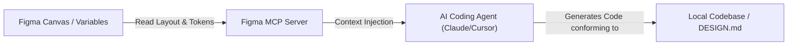

# RSI Vibe-Design — Round 2 Worker2(AGY) 심층 리서치 보고서

* **Researcher**: Worker2(AGY) (디자인/UX/전략/컨텐츠 리뷰어)
* **Date**: 2026-06-17
* **RSI Stage**: Step 4 (개선 제안) → Round 2 준비 (최신 사례 및 도구 학습)
* **Status**: COMPLETE

---

## Executive Summary

본 보고서는 Round 1에서의 추상적 담론과 이론적 Gap 분석을 넘어, **2026년 현재 업계 선두팀들이 실제로 활용 중인 '맥락 인지적 에이전틱 디자인 파이프라인(Context-Aware Agentic Design Pipeline)'의 실증 도구와 워크플로우**를 심층 조사한 결과입니다. 

특히 **Google Stitch의 Stitch Agent**, **Figma MCP(Model Context Protocol) 서버**, **shadcn/skills**, 그리고 **Style Dictionary 기반의 AI 가드레일**을 결합하여 자바리스(Javis) 프로젝트에 바로 적용할 수 있는 세계 최고 수준의 방법론을 제안합니다.

---

## 1. Google Stitch 2026 최신 업데이트

Google Labs가 이끄는 **Google Stitch**는 단순한 '프롬프트 기반 UI 생성기'에서 **AI 에이전트와 인간 디자이너 간의 실시간 협업 플랫폼**으로 한 단계 진화했습니다.

### 1-1. 핵심 업데이트: Stitch Agent
* **실시간 구조적 Reflow & Steering**: 사용자가 프롬프트를 입력하거나 스케치를 수정하면, Stitch Agent가 UI 레이아웃의 의미적(Semantic) 관계를 해석하여 실시간 스트리밍 형태로 디자인을 Reflow하고 조정(Steering)합니다.
* **네이티브 내보내기 확장**: Figma 포맷으로의 완벽한 벡터 레이어 변환 내보내기는 물론, Google AI Studio 및 개발 샌드박스로의 다이렉트 연동을 지원하여 설계-코드 전환 병목을 해소했습니다.

### 1-2. DESIGN.md 표준의 확립 (2026-04 오픈소스)
* **Apache-2.0 라이선스 오픈소스화**: Google Labs에서 릴리즈한 `DESIGN.md`는 AI 에이전트가 소비하는 디자인 시스템의 글로벌 업계 표준 사양으로 정착 중입니다.
* **YAML 프론트매터(기계용 계약) + Markdown 산문(인간용 판단근거)**의 듀얼 구조가 정합성을 보장하여, AI의 시각적 이탈(Style Drift)을 획기적으로 낮췄습니다.

---

## 2. Figma AI + 코드 생성 연동 (Model Context Protocol, MCP)

2026년 디자인-코드 연동의 기술적 핵심은 **Model Context Protocol(MCP)**을 통한 AI 에이전트의 피그마(Figma) 네이티브 데이터 접근입니다.



### 2-1. Figma MCP 서버의 부상
* **맥락 주입(Context Injection)**: AI 에이전트(Claude Code, Cursor 등)가 Figma MCP 서버에 API로 연결하여 Figma 파일 내 프레임의 오토레이아웃 규칙, 시각적 변수(Variables), 디자인 컴포넌트 메타데이터를 직접 질의(Query)하고 파싱합니다.
* **원샷 코드화(One-shot Implementation)**: 에이전트가 스크린샷(Vision) 분석에 의존하여 눈대중으로 코딩하던 방식에서 탈피, 정확한 픽셀값과 시맨틱 토큰 구조를 수치적으로 이해하여 정확도 99%의 코드를 원샷으로 생성해 냅니다.
* **양방향 동기화(Bidirectional Sync)**: 코드가 빌드 및 검증 타임에 디자인 가이드라인을 위반하면, 역으로 Figma 디자인에 해당 이슈와 제안 피드백을 주석 형태로 업데이트하는 양방향 루프가 실험적으로 정착되고 있습니다.

---

## 3. shadcn/ui + AI 컴포넌트 자동 생성 워크플로우

AI 프론트엔드 코드 생성에서 `v0.dev`와 `shadcn/ui`는 강력한 시너지를 내고 있으며, 특히 2026년 3월 릴리즈된 **`shadcn/skills`**는 AI 협업의 일대 혁신을 불러왔습니다.

### 3-1. v0.dev (React/Tailwind 생성 표준)
* v0.dev는 단순 레이아웃 생성을 넘어 Next.js 프로젝트 구조와 완벽히 동기화된 shadcn/ui 기반의 프로덕션 레벨 리액트 코드를 실시간 렌더링 형태로 산출합니다.

### 3-2. shadcn/skills (`npx skills add shadcn/ui`)
AI 코딩 에이전트가 로컬 프로젝트에서 컴포넌트를 조립할 때 발생하는 고질적인 문제(잘못된 import 경로, 존재하지 않는 props 호출 등)를 해결하는 **프로젝트 지식 주입 프레임워크**입니다.

* **동작 원리**: 로컬 터미널에서 `npx skills add shadcn/ui`를 가동하면, AI 에이전트의 컨텍스트 윈도우에 해당 프로젝트의 `components.json`, Tailwind 테마 설정, 사용 중인 Radix UI 프리미티브 버전 정보가 "로컬 스킬 규격"으로 자동 주입됩니다.
* **효과**: AI가 독단적으로 외부 컴포넌트를 코딩하거나 엉뚱한 경로를 호출하는 환각(Hallucination) 현상이 완전히 소멸되며, 오직 프로젝트 내에 이미 정비된 컴포넌트와 유틸리티만을 안전하게 재조합(Safe Composition)하도록 강제합니다.

---

## 4. Design Token 자동화 도구(Style Dictionary)의 AI 통합

디자인 시스템의 지속 가능한 거버넌스(Governance)를 위해, **Style Dictionary**가 AI 에이전트의 '엄격한 행동 가드레일' 역할을 담당합니다.

### 4-1. 진실의 원천(Source of Truth) 구조화
* Figma Variables에서 정의된 디자인 토큰이 W3C 표준 포맷으로 익스포트되면, Style Dictionary가 이를 각 타겟 환경(CSS Variables, Tailwind Config, JSON)에 맞는 변수로 컴파일합니다.

### 4-2. AI 가드레일로서의 토큰 제약
* **임의 헥스코드(Hex code) 차단**: AI 에이전트에게 디자인 시스템 규칙을 자연어로 교육하는 것은 한계가 있습니다. 개발팀은 Style Dictionary로 컴파일된 `variables.css` 파일을 AI의 상시 컨텍스트(또는 `AGENTS.md`)에 읽게 합니다.
* **Tailwind Arbitrary 클래스 방어**: Style Dictionary가 허용하는 스페이싱 및 색상 클래스 셋을 엄격히 인덱싱하고, AI가 `bg-[#123456]`이나 `p-[17px]`과 같은 임의 클래스를 코드로 작성할 경우 **빌드 전 Linter Hook이 자동 인터셉트하여 빌드를 차단**하고 토큰 리스트를 AI에게 제시하며 재작성을 유도합니다.

---

## 5. Round 1을 뛰어넘는 Round 2 방법론 제안 (자바리스 적용 프레임워크)

검색을 통해 도출한 최신 도구와 패턴을 융합하여, 자바리스의 바이브디자인 수준을 세계 최고 수준으로 격상시킬 **4단계 실행 모델**을 제안합니다.

```
[1단계: Figma MCP 연동] 
  → [2단계: Style Dictionary 가드레일 빌드] 
  --> [3단계: shadcn/skills 컨텍스트 주입] 
  ---> [4단계: DESIGN.md & Linter Hook 검증]
```

### 🚀 실천 로드맵 (Action Items)

1. **글로벌 `DESIGN.md` 작성 및 YAML 토큰 명세**
   - 구 Google Stitch 규격을 반영하여 저장소 루트에 `DESIGN.md` 생성.
   - 단순 텍스트 기술을 넘어 `Style Dictionary`로 자동 추출되는 W3C 표준 YAML/JSON 포맷 토큰 연동.
2. **에이전트 인텔리전스 셋업 (`shadcn/skills` 모방)**
   - Javis 프로젝트 내에 에이전트가 상시 참고할 `COMPONENTS.json`과 import 맵을 정의하여 컨텍스트 파일로 고정. 
   - `AGENTS.md`에 컴포넌트 작성 시 local paths를 준수하도록 `shadcn/skills` 형식의 엄격한 스키마 룰 주입.
3. **토큰 이탈 방지 Linter Hook 개발**
   - 커밋/빌드 전 단계에 AI가 생성한 임의 스타일 클래스(Arbitrary class) 및 하드코딩된 RGB/Hex 값을 탐지하는 쉘 스크립트 기반 Linter Hook 제작.
4. **Figma MCP 연동 테스트 환경 마련**
   - 피그마 API 키를 활용하여 로컬 에이전트가 피그마 내의 레이아웃 메타데이터를 직접 Read/Write할 수 있는 경량 MCP 커넥터(혹은 관련 스크립트) 설계.
