# GlobalNews 아키텍처 리뷰

대상 파일:
- `src/crawling/crawler.py`
- `src/crawling/pipeline.py`
- `src/analysis/pipeline.py`
- `src/utils/error_handler.py`
- `src/utils/self_recovery.py`
- `src/config/constants.py`
- `main.py`

## 총평

전체 구조는 단일 CLI에서 크롤링과 8단계 분석을 실행하는 staged monolith입니다. 크롤링 쪽은 `CrawlingPipeline`이 실질적인 주 오케스트레이터이고, `crawler.py`의 `Crawler`는 더 단순한 단일 사이트/구형 오케스트레이터 성격입니다. 분석 쪽은 `AnalysisPipeline`이 stage runner를 지연 import하면서 단계별 메모리 정리와 체크포인트 검증을 수행합니다.

좋은 점은 역할 분리가 비교적 명확하고, `constants.py`를 SOT로 삼으려는 의도가 강하며, JSONL 원자적 쓰기, CrawlState, circuit breaker, retry manager, bypass state, analysis stage result 같은 복구 장치가 여러 층에 배치되어 있다는 점입니다. 남은 핵심 위험은 복구 체계가 많아진 만큼 상태 출처가 분산되어 있고, 일부 런타임 불변성이 `assert`와 private field 접근에 기대며, self-recovery 모듈이 메인 실행 경로에 충분히 통합되어 있지 않다는 점입니다.

## 1. 모듈 의존성 그래프

```mermaid
flowchart TD
  main[main.py CLI] --> constants[src.config.constants]
  main --> logging[src.utils.logging_config]
  main --> crawlpipe[src.crawling.pipeline]
  main --> analysispipe[src.analysis.pipeline]
  main --> configloader[src.utils.config_loader]

  crawlpipe --> constants
  crawlpipe --> crawler[src.crawling.crawler: JSONLWriter/CrawlState]
  crawlpipe --> contracts[src.crawling.contracts]
  crawlpipe --> network[src.crawling.network_guard]
  crawlpipe --> discovery[src.crawling.url_discovery]
  crawlpipe --> extractor[src.crawling.article_extractor]
  crawlpipe --> browser[src.crawling.browser_renderer]
  crawlpipe --> adaptive[src.crawling.adaptive_extractor]
  crawlpipe --> dedup[src.crawling.dedup]
  crawlpipe --> ua[src.crawling.ua_manager]
  crawlpipe --> cbcoord[src.crawling.circuit_breaker]
  crawlpipe --> antiblock[src.crawling.anti_block]
  crawlpipe --> bypass[src.crawling.dynamic_bypass]
  crawlpipe --> retry[src.crawling.retry_manager]
  crawlpipe --> report[src.crawling.crawl_report]
  crawlpipe --> err[src.utils.error_handler]
  crawlpipe --> configloader

  crawler --> constants
  crawler --> contracts
  crawler --> network
  crawler --> discovery
  crawler --> extractor
  crawler --> err

  analysispipe --> constants
  analysispipe --> err
  analysispipe --> stage1[src.analysis.stage1_preprocessing]
  analysispipe --> stage2[src.analysis.stage2_features]
  analysispipe --> stage3[src.analysis.stage3_article_analysis]
  analysispipe --> stage4[src.analysis.stage4_aggregation]
  analysispipe --> stage5[src.analysis.stage5_timeseries]
  analysispipe --> stage6[src.analysis.stage6_cross_analysis]
  analysispipe --> stage7[src.analysis.stage7_signals]
  analysispipe --> stage8[src.analysis.stage8_output]

  err --> constants
  selfrec[src.utils.self_recovery] --> constants_like_paths[data dirs/checkpoints/locks]
```

### 구조 관찰

- `main.py`는 CLI 라우터입니다. `cmd_crawl`, `cmd_analyze`, `cmd_full`, `cmd_status`로 분기하고 실제 작업은 크롤링/분석 파이프라인에 위임합니다.
- `src/crawling/pipeline.py`가 현재 크롤링의 주 경로입니다. 병렬 사이트 실행, 재시작, never-abandon, dynamic bypass, dedup, UA rotation, circuit breaker를 모두 조정합니다.
- `src/crawling/crawler.py`는 `JSONLWriter`와 `CrawlState`를 제공하며, 별도 `Crawler` 클래스도 갖고 있습니다. 현재 `pipeline.py`는 이 파일에서 writer/state만 재사용합니다. `Crawler` 클래스는 중복 오케스트레이터로 남아 있어 유지보수 혼선을 만들 수 있습니다.
- `src/analysis/pipeline.py`는 8개 분석 stage의 순차 실행자입니다. stage 구현은 런타임에 지연 import되어 초기 로딩 비용과 optional dependency 문제를 줄입니다.
- `src/utils/error_handler.py`는 예외 계층, retry decorator, circuit breaker를 제공합니다. 다만 `pipeline.py`는 별도의 `CircuitBreakerCoordinator`와 `NetworkGuard` 내부 circuit breaker도 함께 쓰므로 circuit breaker 계층이 중복됩니다.
- `src/utils/self_recovery.py`는 lock, health check, checkpoint, cleanup을 제공하지만 `main.py`의 일반 실행 경로에서는 직접 사용되지 않습니다. 운영 안정성 장치가 존재하나 자동 적용은 약합니다.

## 2. 오류 처리와 복구 패턴

### 현재 패턴

- 예외 계층은 `GlobalNewsError` 아래에 `CrawlError`, `AnalysisError`, `StorageError`로 분리되어 있습니다. 크롤링에는 `NetworkError`, `RateLimitError`, `BlockDetectedError`, `ParseError`, 분석에는 `PipelineStageError`, `ModelLoadError`, `SchemaValidationError`, `MemoryLimitError`가 있습니다.
- `retry_with_backoff()`는 지수 backoff, jitter, `RateLimitError.retry_after` 반영, retryable HTTP status 필터를 제공합니다.
- 크롤링 파이프라인은 4단계 복구 모델을 가집니다: URL discovery retry, Standard/TotalWar escalation, L3 rounds, L4 restarts, 이후 never-abandon multi-pass와 DynamicBypassEngine까지 이어집니다.
- `JSONLWriter`는 temp file에 쓰고 close 시 rename 또는 append하여 부분 파일 손상을 줄입니다. 내부 lock이 있어 여러 worker thread가 공유해도 line write는 직렬화됩니다.
- `CrawlState`는 일자별 `.crawl_state.json`에 processed URL과 site complete 상태를 저장합니다. set 변환으로 URL lookup을 O(1)화한 점은 좋습니다.
- 분석 파이프라인은 stage별 `StageResult`를 반환하고, stage 실행 실패를 pipeline 전체 예외로 바로 터뜨리지 않습니다. stage 사이에 `gc.collect()`와 torch CUDA/MPS cache cleanup을 수행합니다.
- `self_recovery.py`는 PID lock, stale lock cleanup, health check, checkpoint resume args, stale temp/log cleanup을 제공합니다.

### 주요 우려

1. 복구 상태의 SOT가 여러 개입니다. `CrawlState`, `RetryManager` 상태, `CircuitBreakerCoordinator`, `NetworkGuard` 내부 circuit breaker, `bypass_state.json`, failure report가 모두 실패/복구 판단에 관여합니다. 설계 의도는 강하지만 상태 동기화가 깨질 때 디버깅 비용이 큽니다.

2. `_crawl_urls()`는 예외 처리 후에도 루프 하단에서 `mark_url_processed()`를 호출합니다. 같은 실행 안에서는 `RetryManager.failed_urls/pending_urls`가 보완하지만, 프로세스 재시작 뒤에는 CrawlState 기준으로 실패 URL이 이미 processed로 보일 수 있습니다. 실패 URL과 성공 URL을 같은 processed set에 넣는 것은 resume semantics를 약하게 만듭니다. 성공/실패/영구 스킵을 별도 상태로 분리하는 편이 안전합니다.

3. `pipeline.py`가 `self._guard._circuit_breakers` 같은 private field에 직접 접근합니다. Never-abandon에서 NetworkGuard 내부 circuit breaker를 리셋하려는 의도는 이해되지만, 내부 구현 변경에 취약합니다. `NetworkGuard.reset_circuit_breaker(site_id)` 같은 공개 API가 필요합니다.

4. 런타임 필수 조건이 `assert`에 많이 의존합니다. Python 최적화 실행(`python -O`)에서는 assert가 제거되므로 `None` 방어가 사라집니다. 운영 코드에서는 명시적 예외나 초기화 완료 타입을 보장하는 구조가 낫습니다.

5. `self_recovery.py`의 checkpoint 기능은 독립 CLI로는 완성도가 있지만, `main.py`의 `cmd_crawl/cmd_analyze/cmd_full` 흐름에서 lock 획득, checkpoint 생성/갱신, timeout handler 적용이 보이지 않습니다. “존재하는 복구 기능”과 “실제 실행에 적용되는 복구 기능” 사이에 간극이 있습니다.

6. 예외 로깅은 전반적으로 충분하지만 일부 `except Exception: pass` 또는 짧은 로그가 남아 있습니다. dedup 실패, UA manager 실패, fallback article 생성 실패 등은 크롤을 계속하기 위한 의도일 수 있으나, 통계/진단 이벤트로는 남기는 편이 좋습니다.

## 3. 설정 관리

### 장점

- `constants.py`가 경로, retry/backoff, circuit breaker, rate limit, crawling defaults, memory, analysis thresholds, model names, validation enums, `ENABLED_DEFAULT`를 중앙화합니다.
- `pipeline.py`, `crawler.py`, `main.py`가 `ENABLED_DEFAULT`, `CRAWL_NEVER_ABANDON`, `MAX_ARTICLES_PER_SITE_PER_DAY`, `DEFAULT_RATE_LIMIT_SECONDS` 등을 import해 사용하므로 magic number 일부가 줄었습니다.
- 날짜별 output directory 구조(`data/raw/YYYY-MM-DD`, `processed/YYYY-MM-DD`, `features/YYYY-MM-DD`, `analysis/YYYY-MM-DD`, `output/YYYY-MM-DD`)는 재실행/부분 재개/일별 추적에 적합합니다.
- `main.py`의 CLI validator는 날짜와 stage 범위를 조기 검증합니다. Python 3.14 이상 거부 가드도 spaCy 호환성 실패를 초기에 막습니다.

### 개선 필요

- `constants.py`와 실제 코드의 기본값이 완전히 일치하지 않습니다. 예: `MAX_MEMORY_GB`는 100GB인데 `analysis/pipeline.py` 주석과 예전 문맥은 5GB/20GB 예산을 말합니다. 설정값과 운영 문서가 어긋나면 memory abort가 사실상 작동하지 않을 수 있습니다.
- `DEFAULT_CONCURRENCY`, `TOTALWAR_DELAY_MULTIPLIER`, `PER_SITE_TIMEOUT_SECONDS`, `_DISCOVERY_MAX_RETRIES`, `_MIN_RSS_BODY_FOR_EXTRACTION` 같은 중요한 값이 `pipeline.py` 내부 상수로 남아 있습니다. 운영 튜닝 대상은 `constants.py` 또는 `pipeline.yaml`로 올리는 편이 좋습니다.
- `self_recovery.py`는 `/tmp`를 lock dir로 고정합니다. Windows 환경에서는 `/tmp`가 의도대로 동작하지 않을 수 있고, 프로젝트별 lock 격리가 약합니다. `PROJECT_ROOT/data/locks` 또는 OS별 temp dir를 쓰는 구성이 안전합니다.
- `BYPASS_STATE_PATH`가 `data/config/bypass_state.json`에 저장됩니다. config 디렉터리에 runtime learning state를 쓰는 것은 “정적 설정”과 “동적 상태”를 섞습니다. `data/state/bypass_state.json` 같은 별도 위치가 더 명확합니다.
- `main.py`의 `_setup_log_tee()`는 crawl/full/analyze 로그를 실행마다 `w`로 엽니다. 모니터링에는 단순하지만 장기 운영 이력 보존과 장애 추적에는 불리합니다. 회전 로그 정책과 일관되게 append 또는 날짜별 로그가 낫습니다.

## 4. 보안 리뷰

### Credentials

- 검토 대상 파일 안에는 API key, 토큰, 비밀번호 같은 평문 credential은 보이지 않습니다.
- `main.py`와 pipeline은 credential을 직접 다루지 않으며, 네트워크/브라우저/bypass 구현체가 외부 credential을 쓸 가능성은 이 리뷰 범위 밖입니다.
- 로그에는 URL, site id, 일부 error message가 기록됩니다. URL query string에 토큰이 포함되는 사이트가 있으면 민감정보가 로그에 남을 수 있습니다. URL logging 전 query redaction helper가 필요합니다.

### Network / Crawling

- 외부 뉴스 사이트에 대해 RSS/sitemap/DOM/browser/bypass 전략을 사용합니다. SSRF 관점에서는 `sources.yaml`과 discovery 결과 URL이 신뢰 경계입니다. 현재 검토 파일에서는 URL scheme/domain allowlist 검증이 명확히 보이지 않습니다.
- `_collect_discovery_urls()`는 상대 URL을 `urljoin`으로 절대화하지만, 최종 URL이 `http/https`인지, 사설 IP/localhost/metadata IP인지 차단하는 로직은 이 파일에 없습니다. `NetworkGuard`에 있다면 좋지만, pipeline 레벨에서도 신뢰 경계를 명시하는 것이 안전합니다.
- DynamicBypassEngine와 browser rendering은 강력한 네트워크/브라우저 기능을 갖습니다. 사이트 config가 오염되면 내부망 요청 또는 과도한 요청이 가능할 수 있으므로 config validation과 outbound allow policy가 중요합니다.

### Injection / Parsing

- JSONL output은 `RawArticle.to_jsonl_line()`에 의존합니다. JSON 직렬화를 쓰면 라인 단위 injection 위험은 낮지만, 후속 HTML/SQLite/FTS 렌더링 단계에서는 title/body escaping이 별도로 필요합니다.
- `_parse_discovery_response()`의 HTML link 추출은 regex 기반입니다. 기능적으로는 fallback이라 이해되지만 HTML entity, base tag, malformed HTML, javascript/data URL 방어 측면에서는 robust parser가 더 안전합니다.
- CLI 인자는 argparse로 처리되어 shell injection과 직접 연결되지는 않습니다. 다만 `--sites`, `--groups` 값은 로그와 파일 상태에 들어가므로 길이 제한/문자 whitelist가 있으면 운영 안정성이 좋아집니다.

### File Safety

- JSONLWriter와 CheckpointManager는 temp-write 후 rename 패턴을 사용해 파일 손상을 줄입니다.
- `CleanupManager.cleanup_incomplete_runs()`는 조건에 맞는 과거 raw date directory를 `shutil.rmtree()`로 삭제합니다. 프로젝트 root 계산이 틀리거나 data dir가 잘못 잡히면 위험할 수 있으므로 resolved path가 project root 하위인지 검증하는 guard가 있으면 좋습니다.

## 5. 동시성 및 리소스 관리

### 동시성 구조

- `CrawlingPipeline._run_single_pass()`는 `ThreadPoolExecutor(max_workers=DEFAULT_CONCURRENCY)`로 사이트 단위 병렬 크롤링을 수행합니다. 기본 동시성은 5입니다.
- 하나의 `JSONLWriter`를 여러 thread가 공유하고, writer 내부 lock으로 write count와 file write를 보호합니다. ThreadPoolExecutor context가 종료된 뒤 writer가 close되므로 write-after-close 위험은 낮습니다.
- `CrawlState`는 `RLock`으로 URL/site 상태 접근을 보호합니다. 다만 save는 사이트 worker 종료 시점마다 발생할 수 있어 병렬 write contention이 있습니다. 현재 lock으로 직렬화되지만 많은 사이트에서는 저장 빈도를 조절할 필요가 있습니다.
- `SiteDeadline`은 worker 실행 시점에 생성되어 queue 대기 시간이 timeout을 갉아먹는 문제를 피합니다. timeout은 강제 kill이 아니라 URL boundary에서 yield하는 cooperative 방식입니다. 이 설계는 데이터 손상 위험이 낮습니다.

### 리소스 관리 장점

- `NetworkGuard.close()`, `DedupEngine.close()`가 pipeline close에서 호출됩니다.
- BrowserRenderer는 optional로 초기화되고 unavailable이면 degrade합니다.
- 분석 stage는 지연 import와 stage 간 cleanup을 통해 모델/메모리 수명을 제한하려고 합니다.
- Stage5/Stage7 객체는 `finally: cleanup()`이 있어 stage 내부 리소스 회수가 비교적 명확합니다.
- `JSONLWriter.close()`는 flush/fsync 후 replace/append를 수행합니다.

### 주요 리스크

1. shared subsystem의 thread safety가 외부 클래스 구현에 의존합니다. `NetworkGuard`, `DedupEngine`, `UAManager`, `RetryManager`, `CircuitBreakerCoordinator`, `AntiBlockEngine`, `DynamicBypassEngine`가 모두 여러 worker thread에서 공유됩니다. 이 파일 안에서는 일부 pre-init과 writer/state lock만 보입니다. 공유 객체별 thread-safety 계약을 명문화하고 테스트해야 합니다.

2. `JSONLWriter.close()`에서 기존 파일이 있으면 temp 전체를 `src.read()`로 읽어 append합니다. temp가 매우 커지면 메모리를 크게 쓸 수 있습니다. chunked copy가 더 안전합니다.

3. global timeout에서 `future.cancel()`을 호출하지만 이미 실행 중인 thread는 취소되지 않습니다. context manager는 `shutdown(wait=True)`를 수행하므로 실제 hang thread가 있으면 여전히 기다릴 수 있습니다. cooperative deadline이 대부분 해결하지만 blocking network/browser 호출이 deadline을 확인하지 못하면 장시간 걸릴 수 있습니다.

4. `RateLimitError.retry_after` 처리와 retry delay가 `time.sleep()` 기반입니다. worker thread를 점유하는 방식이라 많은 사이트가 rate-limit에 걸리면 thread pool 처리량이 낮아집니다. 현재 규모에서는 단순성이 장점이지만, 대규모 확장에는 async 또는 scheduled retry queue가 더 적합합니다.

5. 분석 메모리 모니터는 `resource.getrusage().ru_maxrss`를 사용합니다. 이 값은 current RSS가 아니라 peak RSS입니다. 한 번 threshold를 넘으면 cleanup 후에도 계속 높게 보일 수 있습니다. “현재 메모리” 판단에는 psutil RSS가 더 정확합니다.

6. `MemoryMonitor.get_rss_gb()`는 `resource`가 있을 때 `os.uname()`를 호출합니다. Windows에서는 `resource` import가 실패하므로 괜찮지만, portability 관점에서는 platform 모듈 기반 분기가 더 명시적입니다.

7. `main.py`의 `_setup_log_tee()`는 log file handle을 닫지 않습니다. 프로세스 종료 시 회수되지만 장기 실행/테스트 반복에서는 context 관리가 낫습니다.

## 우선순위 개선안

1. `CrawlState`의 processed URL 모델을 `success_urls`, `failed_urls`, `skipped_urls`로 분리하십시오. 실패 URL을 processed로 저장하면 재시작 후 복구 가능성이 떨어집니다.

2. `NetworkGuard`에 public circuit breaker reset API를 추가하고 `pipeline.py`의 `_guard._circuit_breakers` 직접 접근을 제거하십시오.

3. `assert self._x is not None` 패턴을 초기화 완료 객체 또는 명시적 guard 함수로 대체하십시오. 운영 코드의 필수 불변성은 `assert`에 맡기지 않는 편이 안전합니다.

4. `self_recovery.py`를 `main.py` 실행 경로에 통합하십시오. 최소한 full/crawl/analyze 실행 전에 health check와 lock acquire를 수행하고, finally에서 lock release 및 checkpoint update/clear를 보장해야 합니다.

5. 설정 SOT를 정리하십시오. 운영 튜닝값(`DEFAULT_CONCURRENCY`, `PER_SITE_TIMEOUT_SECONDS`, discovery retry, RSS body threshold, memory warning/abort)을 `constants.py` 또는 YAML로 통합하고, 주석의 예산과 실제 값 불일치를 제거하십시오.

6. URL 보안 정책을 명시하십시오. `http/https` scheme, allowed domain, private IP/localhost/metadata IP 차단, query redaction을 NetworkGuard 또는 URL normalization 계층에서 강제해야 합니다.

7. shared subsystem thread-safety 테스트를 추가하십시오. 특히 `DedupEngine.is_duplicate/register`, `RetryManager.get_state/handle_url_failure`, `CircuitBreakerCoordinator.record_*`, `UAManager.get_ua`는 동시 호출 테스트가 필요합니다.

8. `JSONLWriter` append path를 chunked copy로 바꾸고, close 중 예외 발생 시 temp file 보존/진단 정책을 명확히 하십시오.

9. 분석 dependency graph와 date-partitioned path remap을 테스트로 고정하십시오. `STAGE_DEPENDENCIES`는 constants의 non-date path를 date path로 remap하므로 회귀가 나기 쉽습니다.

10. `Crawler` 클래스와 `CrawlingPipeline`의 역할을 정리하십시오. `Crawler`가 더 이상 주 경로가 아니면 writer/state만 별도 모듈로 분리하거나, 단일 오케스트레이터로 합치는 편이 아키텍처 혼선을 줄입니다.

## 결론

현재 시스템은 기능 중심으로는 매우 강한 복구 지향 크롤링/분석 파이프라인입니다. 특히 사이트 단위 병렬 처리, cooperative deadline, 다층 retry, DynamicBypassEngine, JSONL 원자적 쓰기, 분석 stage 격리는 좋은 방향입니다.

하지만 운영 안정성 관점에서는 상태 출처가 많고, 일부 복구 기능이 실제 main flow와 분리되어 있으며, 실패 URL 상태 모델과 private field 접근이 장기 유지보수 리스크입니다. 다음 단계는 기능 추가보다 상태 모델 단순화, recovery 통합, URL 보안 경계, thread-safety 계약을 확정하는 것이 가장 효과적입니다.
