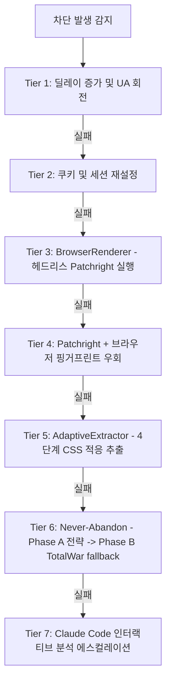
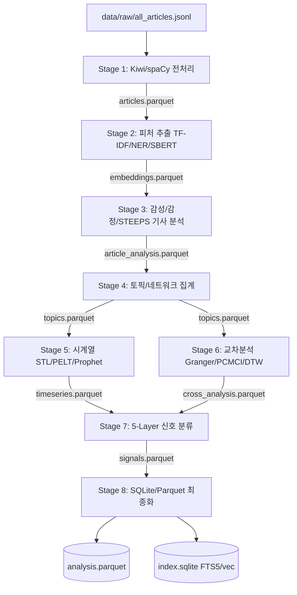
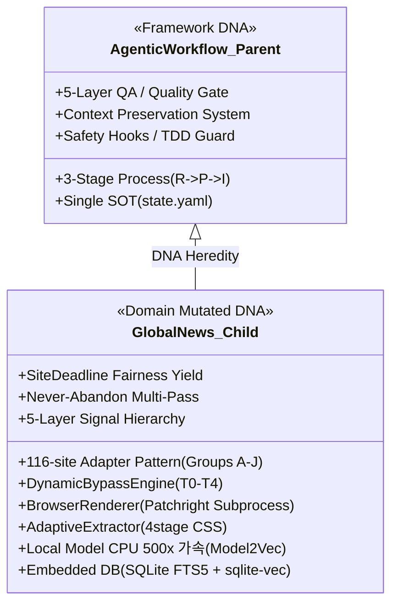

# GlobalNews-Crawling-AgenticWorkflow 기술 분석 보고서

**작성자**: Worker2 (AGY)  
**보고 대상**: 마스터님  
**일시**: 2026-06-16  
**분야**: 디자인, UX, 전략, 콘텐츠 및 기술 아키텍처 검토  

---

## Executive Summary

본 보고서는 **GlobalNews-Crawling-AgenticWorkflow** 시스템의 아키텍처 설계와 기술적 구현 패턴을 분석한 기술 보고서입니다. 본 시스템은 단순한 뉴스 수집기가 아닌, **로컬 자원을 극대화하여 116개 사이트의 페이월을 우회하고 다국어 수집 및 56개 NLP 분석 기법을 거쳐 최종적으로 5-Layer 신호 체계로 압축해 내는 Staged Monolith 빅데이터 분석 시스템**입니다. 또한, 부모 프레임워크인 **AgenticWorkflow**의 유전 DNA를 완벽하게 상속하면서도, 도메인 특화 변이를 이뤄낸 수준 높은 아키텍처를 보유하고 있습니다.

---

## 1. 크롤링 아키텍처 (116개 사이트, 10개 그룹 구조)

GlobalNews 시스템의 수집 파트는 **"영구 수집(Never-Abandon)"**과 **"페이월 및 차단 우회(Anti-Block)"**를 근간으로 설계되었습니다.

### 1.1 10개 수집 그룹 및 116개 사이트 분류 구조

시스템은 전 세계 뉴스 매체를 지역적·언어적·도메인적 다양성에 따라 10개 그룹(A~J)으로 구조화하여 관리합니다.

| 그룹 ID | 그룹명 | 매체 수 | 주요 특징 및 대상 매체 예시 |
|:---:|---|:---:|---|
| **A** | 한국 주요 일간지 | 5 | 조선일보, 중앙일보, 동아일보, 한겨레, 연합뉴스 (Kiwi 토크나이저 연동) |
| **B** | 한국 경제지 | 4 | 매일경제, 한국경제, 파이낸셜뉴스, 머니투데이 |
| **C** | 한국 니치 매체 | 3 | 노컷뉴스, 국민일보, 오마이뉴스 |
| **D** | 한국 IT/과학 전문 | 10 | 38North, 블로터, 전자신문, ZDNet, Stratechery, Techmeme 등 |
| **E** | 영어권 주요 언론 | 22 | NYT, FT, WSJ, CNN, Bloomberg, BBC, Guardian, Politico EU 등 |
| **F** | 아시아-태평양 | 23 | SCMP, 요미우리, 마이니치, The Hindu, Inquirer, VNExpress 등 |
| **G** | 유럽/중동 | 38 | Le Monde, Spiegel, Corriere, El Pais, Al Jazeera, Haaretz 등 |
| **H** | 아프리카 | 4 | AllAfrica, Africanews, The Africa Report, Panapress |
| **I** | 라틴 아메리카 | 8 | Clarin, Folha, El Mercurio, El Tiempo 등 |
| **J** | 러시아/중앙아시아 | 4 | RIA Novosti, Rossiyskaya Gazeta, RBC, GoGo Mongolia |

* **선정 전략**: 7대 권역의 14개 이상의 다국어 텍스트를 커버하며, 정적/동적 렌더링이 혼재하는 환경에서 교차 프레이밍 분석이 가능한 조합으로 선정되었습니다. SNS나 동영상 위주 방송사는 원천 제외하여 텍스트 분석에 최적화하였습니다.

### 1.2 사이트 어댑터 설계 패턴
* **BaseSiteAdapter 상속 모델**: `BaseSiteAdapter` (450+ LOC) 공통 모듈에서 URL 발견(RSS -> Sitemap -> DOM의 3-Tier 방식), 기본 추출 체인, 에스컬레이션 정책 등을 처리하고, 개별 116개 어댑터는 사이트 메타정보, 타겟 CSS 선택자, 전용 페이월 우회 로직만을 최소한으로 구현(오버라이드)하는 구조입니다.
* **P1 사이트 레지스트리 동기화**: `validate_site_registry_sync.py`를 통해 상수, 그룹 정의, 커버리지 검증 등 5개 파일 간의 도메인 매칭 불일치를 사전에 탐지하여 오작동을 차단합니다.

### 1.3 7-Tier 안티블록 & DynamicBypassEngine

차단 감지 모듈(`BlockDetector`)이 IP 차단, rate limit, CAPTCHA, JS Challenge 등 7가지 유형을 진단하면, `DynamicBypassEngine`이 이를 해소하기 위해 7계층 에스컬레이션을 실행합니다.



### 1.4 하드 페이월 우회 시스템 (Paywall Bypass)
Wayback Machine 등 외부 보관 서비스가 통하지 않는 하드 페이월 매체(FT, NYT, WSJ, Le Monde 등)를 극복하기 위해 3중 레이어를 사용합니다.
1. **BrowserRenderer (쿠키 없는 첫 방문 유도)**: 메인 루프(httpx 동기식)와 이벤트 루프가 충돌하지 않도록 **별도 서브프로세스로 Patchright를 비동기 실행(45초 강제 타임아웃)**하여, 메터드 페이월(Metered Paywall)의 쿠키 제약을 무력화합니다.
2. **AdaptiveExtractor (적응형 CSS 추출)**: standard parser가 깨질 경우 캐시 패턴 -> 사이트 고유 CSS -> 범용 CSS -> 40자 이상의 단락 휴리스틱 순으로 본문을 건져냅니다.
3. **is_paywall_body (결정론적 판별)**: 영어 및 프랑스어 페이월 잔존 감지 키워드(Strong 14개, Weak 12개 패턴)의 빈도와 본문 길이를 바탕으로 페이월로 인해 잘린 기사인지 결정론적으로 감별해 내고, 잘린 경우 `is_paywall_truncated=True`로 분류하여 잘못된 데이터가 유입되는 것을 방지합니다.

### 1.5 크롤링 신뢰성 확보 장치
* **4-Level Retry (최대 90회 재시도)**: NetworkGuard(HTTP 5회) -> Standard/TotalWar 모드 전환(2회) -> 크롤러 라운드 백오프(3회) -> 파이프라인 전체 재시작(3회)을 통해 일시적 네트워크 장애를 극복합니다.
* **SiteDeadline Fairness Yield**: 동적 타임아웃(최대 900초)을 다 쓴 느린 사이트는 **포기하지 않고 스레드 워커를 양보(Yield)한 후 큐에 재진입**시킵니다. 이 과정에서 `deadline_yielded=True` 플래그를 설정하여, 불완전하게 수집된 사이트가 완료 처리되는 것을 원천적으로 차단합니다.
* **Multi-Pass Crawling**: 완료되지 않은 사이트를 타겟으로 최대 10회(`MULTI_PASS_MAX_EXTRA`) 반복 패스를 실행합니다.

---

## 2. NLP 분석 파이프라인 (56개 기법 분류)

GlobalNews의 분석 엔진은 **8단계 파이프라인(Stage 1 ~ Stage 8)과 56개 분석 기법**이 유기적으로 엮인 Staged Monolith 구조입니다.

### 2.1 8단계 파이프라인과 입출력 파일 구조



### 2.2 56개 분석 기법 분류 및 단계별 핵심 상세

분석 파이프라인은 기사 단위 모델링에서부터 구조화된 시계열 및 관계망을 거쳐 트렌드 신호로 최종 요약됩니다.

* **Stage 1 (전처리: T01~T06)**: Kiwi 토크나이저(메모리 누수 방지용 싱글톤 적용) 및 spaCy(영어 레마타이저)를 병렬 활용하여 문장 분리, 다국어 감지, 불용어 제거를 수행합니다.
* **Stage 2 (피처 추출: T07~T12)**: 384차원의 SBERT Multilingual 모델, TF-IDF(1만 차원 피처), XLM-RoBERTa 기반 NER, KeyBERT를 적용하여 다차원 피처 공간을 형성합니다.
* **Stage 3 (기사 분석: T13~T19, T49)**:
  * **KoBERT(한국어 감성 F1=94%)** 및 RoBERTa(영어 감성) 모델 운용.
  * Plutchik 기반 **8차원 감정 분석** 및 **STEEPS**(Society, Technology, Economy, Environment, Politics, Spirituality) 분류를 zero-shot BART-MNLI로 판단합니다.
* **Stage 4 (집계: T21~T28)**: 
  * HDBSCAN 밀도 클러스터링과 UMAP 차원 축소 적용.
  * **Model2Vec 가속**: GPU가 없는 로컬 맥북 M2 환경(C3)에서 실행하기 위해 BERTopic에 Model2Vec을 탑재하여 **CPU 환경에서 500배 이상 가속**시켰습니다.
* **Stage 5 (시계열: T29~T36)**: statsmodels STL 분해를 통한 트렌드/계절성 추출, Kleinberg 알고리즘을 통한 버스트(뉴스 폭발) 탐지, `ruptures` PELT 알고리즘에 의한 구조적 변화점(Changepoint) 검출을 독립 실행합니다.
* **Stage 6 (교차 분석: T37~T46, T20, T50)**: Granger 인과관계, 편상관 기반 Tigramite PCMCI 인과 추론, Dynamic Time Warping(DTW), 교차 언어 토픽 정렬(Multilingual Centroid)로 다국어 보도 간의 의제 설정(Agenda Setting) 흐름 및 모순을 추적합니다.
* **Stage 7 (신호 분류: T47~T55)**: 5-Layer 신호 판정을 내리기 위해 LOF(Local Outlier Factor), Isolation Forest 및 KL 다이버전스 등의 변칙 탐지 기법을 융합합니다.

### 2.3 5-Layer 신호 계층 설계 및 L5 Singularity 합성

| 신호 레이어 | 명칭 | 유효 타임프레임 | 판정 핵심 알고리즘 및 지표 |
|:---:|:---:|:---:|---|
| **L1** | Fad (일시적 유행) | 1주 이내 | Kleinberg 버스트 점수 급증 및 지속 기간 7일 미만 |
| **L2** | Short-term (단기 트렌드) | 1~4주 | PELT 변화점 검출 후 4주 이내의 추세 상승 |
| **L3** | Mid-term (중기 변동) | 1~6개월 | STL 트렌드 성분 분석 및 Granger 인과관계 확보 |
| **L4** | Long-term (장기 전환) | 6개월 이상 | 다국어/다양 매체의 교차 보도량 증가 및 6개월 지속성 |
| **L5** | Singularity (특이점) | 12개월 이상 | OOD, Structural, Distribution **3대 독립 경로 중 2개 이상 합의** |

#### L5 Singularity 2-of-3 합의 판정 구조
* **Path 1 (OOD)**: LOF + Isolation Forest 기반의 통계적 이상치(Out-of-Distribution) 감지.
* **Path 2 (Structural)**: PELT 변화점 + BERTrend 분석을 통한 토픽 생애주기의 근본적 구조 변화.
* **Path 3 (Distribution)**: Zipf 분포 편차 + KL 다이버전스를 통한 전반적 언어 분포 격변.
* *이점*: 단일 지표 오탐(False Positive)을 강력히 억제하여 진정한 의미의 패러다임 전환 신호만 정제합니다.

---

## 3. 데이터 흐름 (수집-분석-저장-시각화)

전체 시스템을 관통하는 데이터 파이프라인의 수명 주기는 철저한 원자적 트랜잭션과 메모리 관리를 기반으로 합니다.

```
[116개 웹 매체] ──(httpx/Patchright)──> [data/raw/ YYYY-MM-DD/all_articles.jsonl]
                                                     │
                                                     ▼ (Stage 1-3)
[data/analysis/ YYYY-MM-DD/article_analysis.parquet] <─(gc.collect로 메모리 격리)
                                                     │
                                                     ▼ (Stage 4-7)
[data/output/ YYYY-MM-DD/signals.parquet / topics.parquet]
                                                     │
                                                     ▼ (Stage 8)
┌────────────────────────────────────────────────────┴───────────────────────────────────────────────────┐
│ [최종 저장소 생성]                                                                                     │
│ 1. analysis.parquet (ZSTD 압축 저장)                                                                   │
│ 2. index.sqlite                                                                                        │
│    ├── articles_fts (FTS5 전문 검색)                                                                   │
│    ├── articles_vec (sqlite-vec 384차원 의미 벡터 인덱스)                                               │
│    └── signals_index / topics_index                                                                    │
└────────────────────────────────────────────────────┬───────────────────────────────────────────────────┘
                                                     │
                                                     ▼ (소비자 활용)
   ┌─────────────────────────────────────────────────┼────────────────────────────────────────────────┐
   │                                                 │                                                │
   ▼ (Streamlit 대시보드)                             ▼ (DuckDB 2차 분석)                             ▼ (Pandas / SQL 검색)
   - 6개 Tab 시각화                                  - Parquet 직접 고속 쿼리                         - FTS5 키워드 & vec 의미 검색
```

### 3.1 단계별 데이터 흐름
1. **수집 단계**: `all_articles.jsonl`에 누적 기록되며, 중복 제거기(`dedup.py`)가 3단계(URL normalize -> Title Jaccard -> SimHash)로 SQLite와 대조하여 고속 필터링합니다.
2. **분석 및 메모리 격리 단계**: Python Monolith 구조에서 거대 로컬 NLP 모델들이 연쇄 실행되므로, OOM(Out of Memory)을 방지하기 위해 **"모델 로드 -> 연산 -> 파일 쓰기 -> 메모리 del -> gc.collect()"**를 강제하는 Staged 구조를 구축하였습니다.
3. **저장 단계**:
   * **Parquet ZSTD**: 컬럼 지향 저장으로 분석 쿼리 속도를 극대화하고 압축 효율을 높였습니다.
   * **SQLite (FTS5 + vec)**: SQLite3 FTS5 가상 테이블을 활용해 형태소 검색을 구현하고, `sqlite-vec` 플러그인을 적용하여 384차원 SBERT 기사 임베딩을 SQLite 내에서 직접 코사인 유사도로 의미 검색할 수 있게 설계했습니다. 외부 검색 데이터베이스 의존성(Elasticsearch, Pinecone 등)을 제로로 만들어 단일 맥북에서의 원활한 가동을 보장합니다.
4. **시각화 및 소비 단계**: 
   * **Streamlit 대시보드**: Overview, Topics, Sentiment & Emotions, Time Series, Word Cloud, Article Explorer 등 6개 탭을 지원하여 분석된 데이터 결과를 인간이 즉시 파악하도록 돕습니다.
   * **DuckDB 연동**: `analysis.parquet` 파일을 별도의 DB 로드 없이 SQL로 즉시 교차 분석 쿼리할 수 있습니다.

---

## 4. AgenticWorkflow 프레임워크 패턴 (만능줄기세포 DNA)

GlobalNews 프로젝트는 부모 프레임워크인 **AgenticWorkflow**로부터 코어 아키텍처와 개발 원칙을 계통적으로 상속(유전)받아 구축되었습니다.

### 4.1 상속받은 부모 DNA (프레임워크 공통 유전)

* **3단계 프로세스 구조**: 모든 워크플로우의 진행은 Research -> Planning -> Implementation의 엄밀한 순차 제약을 지킵니다.
* **단일 파일 SOT (Single Source of Truth) 패턴**: 분산 상태 저장으로 인한 desync를 피하기 위해 `.claude/state.yaml`이라는 하나의 중앙 SOT만을 유지하며, 쓰기 권한은 오케스트레이터에게만 부여됩니다.
* **5계층 QA & 품질 게이트**: L0(Anti-skip)부터 Pre-L1, L1.5, L2 단계에 이르는 강력한 검증이 hook과 스크립트를 통해 강제됩니다.
* **P1 할루시네이션 봉쇄**: 19개 결정론적 검증 스크립트와 D-7 동기화 테스트를 통해 컴포넌트 간 정보 왜복 및 false completion을 물리적으로 차단합니다.
* **Context Preservation (컨텍스트 보존)**: `/clear`나 컨텍스트 압축에 대비해 `latest.md` 스냅샷, `work_log.jsonl`, `knowledge-index.jsonl`에 RLM(Recursive Language Models) 이론을 적용한 상태 포인터를 지속 영속화하여 복원 프로토콜을 구현합니다.
* **Safety Hooks**: Bash 실행 단계에서 파괴적인 셸 명령어나 중요 시크릿 파일의 노출을 정규식 기반으로 사전 차단(exit 2)합니다.

### 4.2 도메인 고유 변이 (GlobalNews 특화 발현)

GlobalNews 도메인에 특화되어 독자적으로 발현되고 고도화된 변이 설계 요소들입니다.



1. **Anti-Block & Paywall Bypass의 변이**: 부모의 크롤링 샘플(`crawling-skill-sample.md`) 수준을 뛰어넘어, Patchright 서브프로세스 격리 구동(`BrowserRenderer`)과 CSS 4단계 휴리스틱 백업(`AdaptiveExtractor`)을 완성하였습니다.
2. **SiteDeadline Fairness Yield 변이**: 병렬 수집 시 병목 사이트의 스레드 점유 문제를 해결하기 위해, 데드라인 만료 시 워커를 양보하고 `deadline_yielded` 플래그를Sticky하게 전파하여 post-pass에서 재해석하는 협력적 스케줄링 구조로 진화했습니다.
3. **가속화된 로컬 모놀리스(Staged Monolith) 변이**: C1(API비용 $0) 및 C3(단일머신) 제약을 극복하고자, Model2Vec을 통한 로컬 CPU 500배 가속 설계와 SQLite 내 FTS5+벡터 인덱스 결합 형태의 내장 아키텍처로 변이 발현되었습니다.
4. **5-Layer Signal 계층 구조 변이**: 단순 트렌드 스코어링을 넘어, L5 Singularity의 2-of-3 합의제 다중 경로 검증 로직으로 구조화되었습니다.

---

## 5. 종합 평가 및 제언 (Reviewer's Perspective)

본 시스템은 **"데이터가 보고서보다 앞선다"**는 명제 하에 엔지니어링의 정밀함과 실용성의 극한을 보여주는 수작입니다. 

### 5.1 아키텍처의 강점
* **극강의 비용 및 리소스 효율성**: 로컬 머신에서 가동하기 위해 CPU 가속과 파일 기반 Parquet-SQLite 데이터 흐름을 긴밀하게 설계하여 클라우드 의존성 및 API 비용을 극적으로 낮췄습니다.
* **수집 신뢰성**: DynamicBypassEngine의 안티블록 극복 체계와 SiteDeadline Yield 및 Multi-Pass 로직은 크롤러가 흔히 겪는 "특정 사이트 수집 실패로 인한 전체 파이프라인 정지 혹은 할루시네이션 완료 마킹" 문제를 논리적 수준에서 완벽하게 통제하고 있습니다.

### 5.2 검토 의견 및 향후 진화 제언
* **메모리 단편화 모니터링 필요**: Staged Monolith 구조에서 `gc.collect()`를 사용하여 메모리 압박을 완화하고 있으나, 다국어 Kiwi 및 spaCy와 BERT 계열 모델들이 단일 Python 프로세스 라이프사이클 내에서 실행되므로, 장기 배치 시 C-level 메모리 단편화(fragmentation) 누적이 감지될 수 있습니다. 대량 처리가 예정될 경우 프로세스를 분할 구동하는 wrapper 스크립트의 확장을 제안합니다.
* **어댑터 자동 갱신 레이어**: 116개 사이트의 DOM 구조 변화에 종속되는 CSS 선택자 하드코딩 오류를 방지하기 위해, 실패율이 증가하는 사이트의 DOM 구조를 AI가 수동 개입 없이 자율적으로 스캔하여 수정사항을 `sources.yaml`에 반영하는 자동 셀프힐링(Self-Healing) 어댑터 루프의 탑재를 검토할 가치가 있습니다.

---
*보고 완료. 본 문서는 지정된 저장소에 안전하게 작성되었습니다.*
